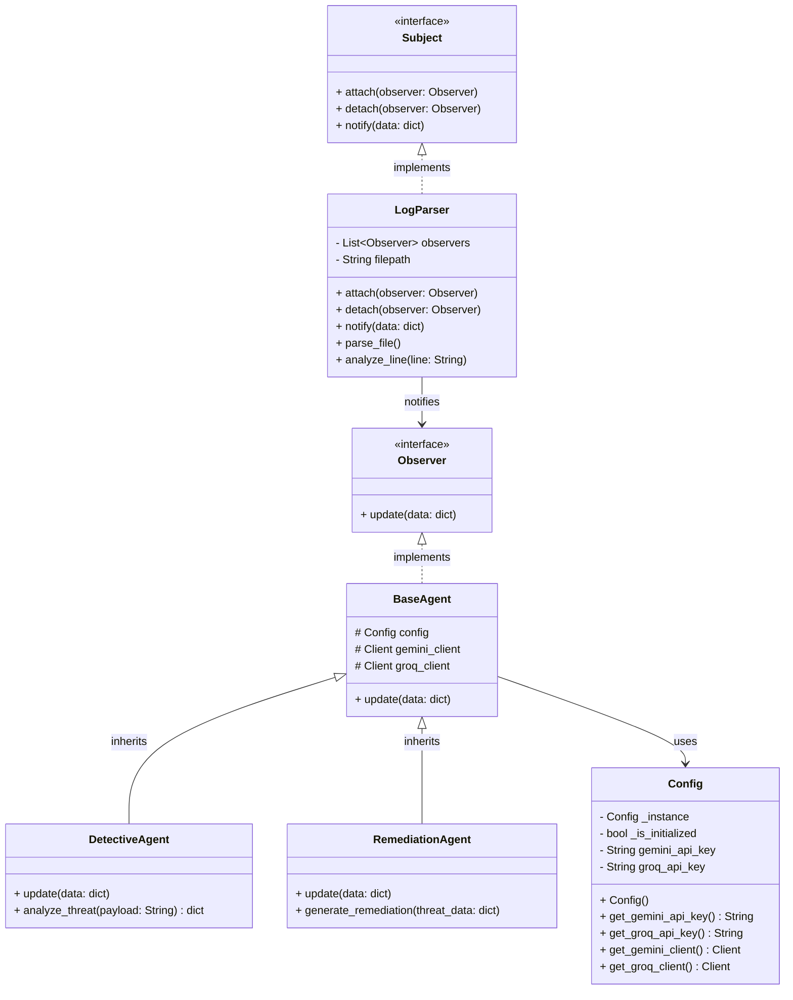

# NetworkGuard - AI-Powered Threat Analyzer

NetworkGuard is an automated cybersecurity monitoring system that parses network logs in real-time, leverages multiple Artificial Intelligence models to classify malicious payloads, and autonomously generates mitigation strategies (firewall rules) and formal incident reports.

---

## Project Structure

```text
.
├── .env                  # API keys (not in version control)
├── access.log            # Dummy access log to be parsed
├── agents/               # AI Agents directory
│   ├── base_agent.py
│   ├── detective_agent.py
│   └── remediation_agent.py
├── config.py             # Configuration Singleton
├── log_parser.py         # Log parser and Observer Subject
├── main.py               # Application entry point
├── README.md             # Project documentation
├── reports/              # Auto-generated incident reports
├── requirements.txt      # Python dependencies
└── tests/                # Automated pytest suite
    └── test_log_parser.py
```

## How to Run

1. **Set up a Virtual Environment (Recommended):**
   ```bash
   python -m venv .venv
   source .venv/bin/activate
   ```
   *(Note for Fish shell users [such as myself :p]: `source .venv/bin/activate.fish`)*

2. **Install Dependencies:**
   Install the required external packages (`google-genai`, `groq`, `pytest`, etc.):
   ```bash
   pip install -r requirements.txt
   ```

3. **Configure Environment Variables:**
   Create a `.env` file in the root of the project and add your API keys:
   ```env
   GEMINI_API_KEY="your_gemini_api_key_here"
   GROQ_API_KEY="your_groq_api_key_here"
   ```
   *(Note: If you run the script without keys, it will fall back to a mock demonstration mode.)*

4. **Run the Application:**
   ```bash
   python main.py
   ```

5. **Optionally, run the Automated Tests:**
   ```bash
   pytest tests/
   ```

---

## Architecture and UML

NetworkGuard is built upon the following logical structure:

### System Workflow

The system follows a clear data flow:
1. **Input:** A log file (e.g., access log) that is read line by line by `LogParser`.
2. **Notification:** When `LogParser` identifies a suspicious line, it notifies all subscribed agents using the **Observer** design pattern.
3. **Analysis (Agent 1):** `DetectiveAgent` receives the alert, analyzes the payload using the LLM model (Google Gemini), and returns a classification (e.g., SQL Injection) along with a risk score (1-10).
4. **Remediation (Agent 2):** `RemediationAgent` receives the data from the Detective, automatically generates the mitigation command (e.g., an `iptables` rule), and generates a short incident report using a second LLM model (Groq/Mixtral).

### Class Diagram (UML)



### Design Patterns Used

1. **Singleton (`Config`):** Ensures the existence of a single configuration instance throughout the system, especially for efficiently managing the API sessions with the external AI providers (Gemini and Groq).
2. **Observer (`Subject` / `Observer`):** Decouples the log reading module (`LogParser`) from the AI agents. Any number of agents can be added (e.g., a Slack notification agent) without modifying the file reading logic.

---

## AI Tools Usage


### Overview
During the development of this project, Artificial Intelligence tools were utilized to accelerate development, implement complex design patterns, debug errors, and generate testing suites. The primary AI assistant used was **Antigravity (powered by Gemini)**. Full Read/Write access was given (except for `.env`) in order to maximize context and increase prompt efficiency.

### 1. Code Generation & Architecture
- **Design Patterns:** The AI was prompted to help scaffold the architecture of the application using the **Singleton** pattern (for `config.py` API key management) and the **Observer** pattern (to decouple the `log_parser.py` from the agents).
- **Multi-Agent System:** The AI was utilized to help implement the integrations for two distinct LLM providers (Google Gemini via `google-genai` and Meta Llama-3/Mixtral via `groq`).

### 2. Debugging & Refactoring
- **Model Deprecation Fixes:** During development, the Gemini 2.5 and Llama 3 models were decommissioned by their respective APIs. The AI assistant was used to rapidly debug the 404/400 HTTP errors and migrate the codebase to `gemini-3.6-flash` and `mixtral-8x7b-32768`.
- **Regex Parsing:** DeepSeek/Qwen models inject `<think>` blocks into their output. The AI assistant was used to write robust Regex (`re.sub`) to strip these blocks out so the incident reports could be formatted cleanly.

### 3. Automated Testing
- **Test Generation:** The AI was utilized to generate a robust `pytest` suite (`tests/test_log_parser.py`). Rather than writing simple I/O tests manually, the AI was prompted to create a `MockAgent` class to formally verify that the Observer design pattern was correctly dispatching notifications only when malicious payloads were detected.


The use of AI tools significantly improved the structural integrity of the project (via Design Patterns) and reduced the time spent wrestling with API changes, allowing the core focus to remain on the cybersecurity logic and multi-agent workflows.

---

## References
- [Singleton Design Pattern](https://www.geeksforgeeks.org/system-design/singleton-design-pattern/)
- [Observer Design Pattern](https://www.geeksforgeeks.org/system-design/observer-pattern-set-1-introduction/)
- [Example Apache Error log](https://raw.githubusercontent.com/logpai/loghub/master/Apache/Apache_2k.log)