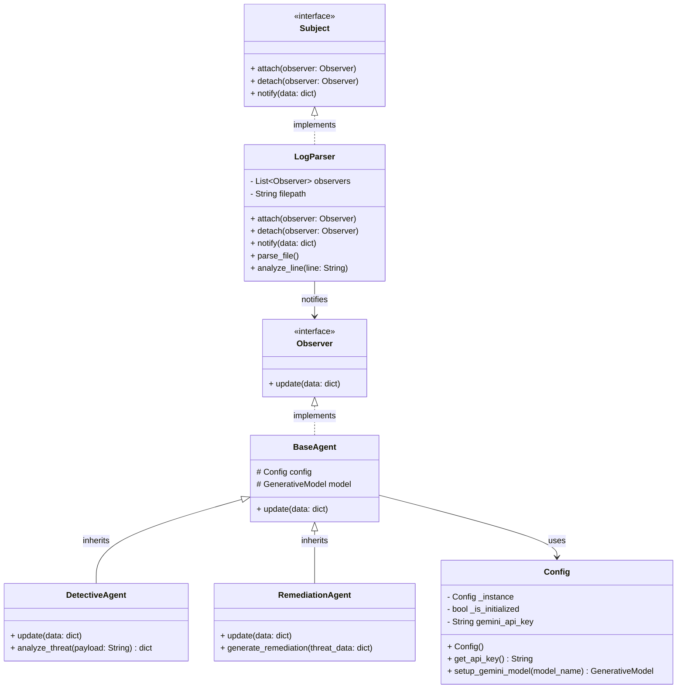

# Arhitectură și UML

Acest document descrie arhitectura sistemului "Garda de Fier pe Rețea" (AI-Powered Network Threat Analyzer) și satisface cerințele legate de specificații și Design Patterns.

## Workflow-ul Sistemului

Sistemul urmează un flux clar de date:
1. **Intrare:** Un fișier de log (ex. access log) care este citit linie cu linie de `LogParser`.
2. **Notificare:** Atunci când `LogParser` identifică o linie suspectă, notifică toți agenții abonați folosind design pattern-ul **Observer**.
3. **Analiza (Agent 1):** `DetectiveAgent` primește alerta, analizează structura folosind modelul LLM (Google Gemini) și returnează o clasificare (ex. SQL Injection) cu un scor de risc (1-10).
4. **Remediere (Agent 2):** `RemediationAgent` primește datele de la Detective, generează automat comanda de mitigare (ex. o regulă `iptables`) și generează un scurt raport de incident.

## Diagramă de Clase (UML)

## Design Patterns Utilizate

1. **Singleton (`Config`):** Asigură existența unei singure instanțe de configurare în întreg sistemul, mai ales pentru gestionarea eficientă a sesiunii cu API-ul extern (Gemini).
2. **Observer (`Subject` / `Observer`):** Decuplează modulul de citire log-uri (`LogParser`) de agenții de inteligență artificială. Orice număr de agenți pot fi adăugați (ex: un agent de notificare Slack) fără a modifica logica de citire a fișierului.
