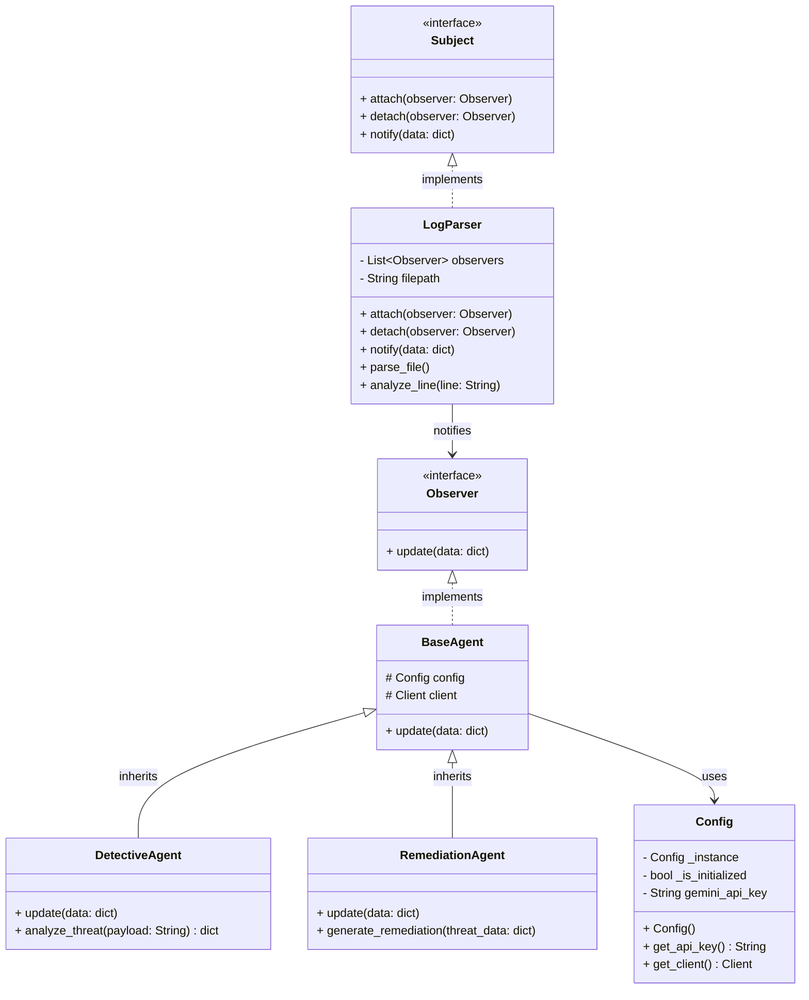

# Architecture and UML

This document describes the architecture of the "NetworkGuard" (AI-Powered Network Threat Analyzer) system and satisfies the requirements related to specifications and Design Patterns.

## System Workflow

The system follows a clear data flow:
1. **Input:** A log file (e.g., access log) that is read line by line by `LogParser`.
2. **Notification:** When `LogParser` identifies a suspicious line, it notifies all subscribed agents using the **Observer** design pattern.
3. **Analysis (Agent 1):** `DetectiveAgent` receives the alert, analyzes the payload using the LLM model (Google Gemini), and returns a classification (e.g., SQL Injection) along with a risk score (1-10).
4. **Remediation (Agent 2):** `RemediationAgent` receives the data from the Detective, automatically generates the mitigation command (e.g., an `iptables` rule), and generates a short incident report.

## Class Diagram (UML)

## Design Patterns Used

1. **Singleton (`Config`):** Ensures the existence of a single configuration instance throughout the system, especially for efficiently managing the session with the external API (Gemini).
2. **Observer (`Subject` / `Observer`):** Decouples the log reading module (`LogParser`) from the AI agents. Any number of agents can be added (e.g., a Slack notification agent) without modifying the file reading logic.
