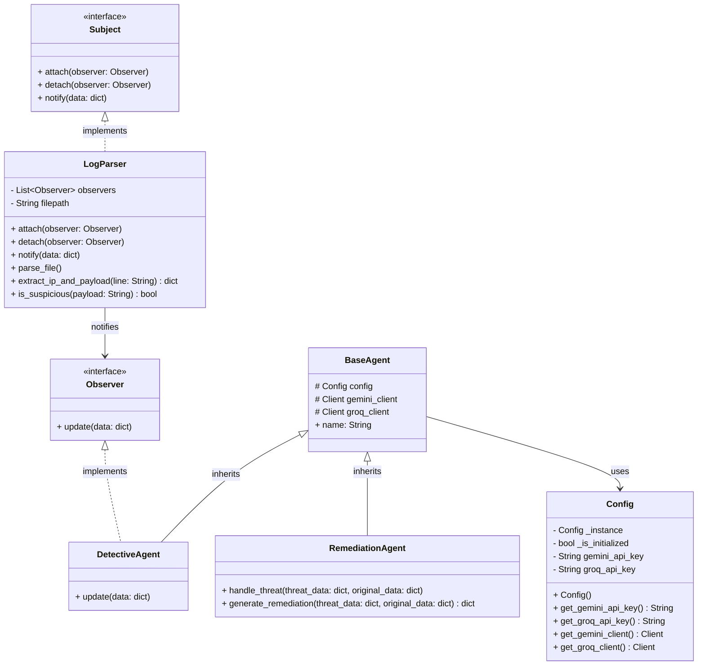

```mermaid
classDiagram
    class Config {
        - Config _instance
        - bool _is_initialized
        - String gemini_api_key
        - String groq_api_key
        + Config()
        + get_gemini_api_key() String
        + get_groq_api_key() String
        + get_gemini_client() Client
        + get_groq_client() Client
    }
    
    class Subject {
        <<interface>>
        + attach(observer: Observer)
        + detach(observer: Observer)
        + notify(data: dict)
    }
    
    class Observer {
        <<interface>>
        + update(data: dict)
    }
    
    class LogParser {
        - List~Observer~ observers
        - String filepath
        + attach(observer: Observer)
        + detach(observer: Observer)
        + notify(data: dict)
        + parse_file()
        + extract_ip_and_payload(line: String) dict
        + is_suspicious(payload: String) bool
    }
    
    class BaseAgent {
        # Config config
        # Client gemini_client
        # Client groq_client
        + name: String
    }
    
    class DetectiveAgent {
        + update(data: dict)
    }
    
    class RemediationAgent {
        + handle_threat(threat_data: dict, original_data: dict)
        + generate_remediation(threat_data: dict, original_data: dict) dict
    }
    
    Subject <|.. LogParser : implements
    Observer <|.. DetectiveAgent : implements
    BaseAgent <|-- DetectiveAgent : inherits
    BaseAgent <|-- RemediationAgent : inherits
    LogParser --> Observer : notifies
    BaseAgent --> Config : uses
```